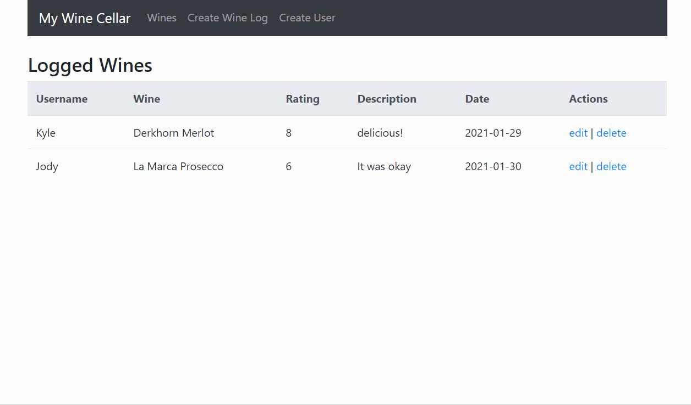

# My Wine Cellar
My Wine Cellar is a MERN stack project that allows users to track and rate wine!

## Overview
Features of this site include: 
* CRUD operations on routes for users and wines. 
* Mongoose schemas and connection to MondDB Atlas.
* ReactJS, HTML5, CSS, Axios, RESTful API, MongoDB, Express, React, React Router, Node.js, and Mongoose

## Project snapshot

